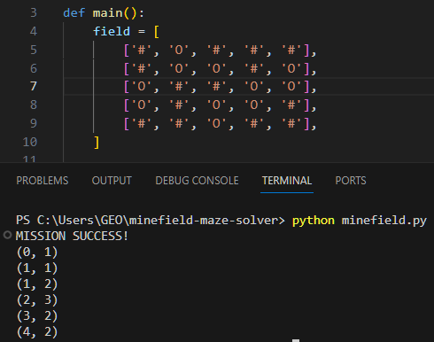
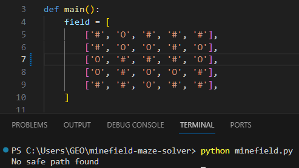
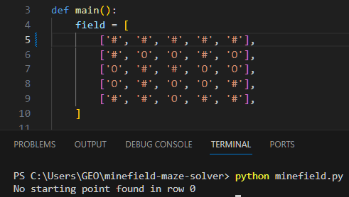

# Minefield Solver  
  
## Requirement:  
  
There is a minefield of size n x m where random fields having a bomb. The safe path always exists. There is a dog named 
Totoshka which can smell if any adjacent field has a bomb. Create an algorithm with would allow Totoshka to pass 
through the minefield.[^1]  
  
There is a girl Ally who is following Totoshka. Ally always stand on the field where Totoshka was before. Totoshka and 
Ally cannot stand on the same field. Create and algorithm for Totoshka and Ally to pass through the minefield.[^2]  
  
Write down the C# implementation of the previous task.[^3]

## HOW TO:  
  
- You are only allowed to change the minefields grid that consist of '#' and 'O'.  
- You are allowed to modify, add, remove rows & columns to suit your preference.  
- You are allowed to move horizontally, vertically and diagonally. (8 directions)  
- Make sure there is a successful path from start (1st row) to end (last row).  

Example below:  

## Minefield SOLO(1)
[^1]: minefield.py  
  

Expected output (success):  

Expected output (fail):  
_No safe path_  
  
  
_No entrance_  

  
### Minefield DUO(2)  

[^2]: minefield_ally.py  
  

Expected output (success):  
  
### Minefield DUO(2)  

[^3]: minefield.cs

